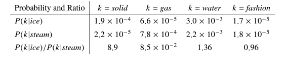

# GloVe: Global Vectors for Word Representation

Welcome to the GloVe Readme! This document serves as a comprehensive guide to understanding GloVe (Global Vectors for Word Representation), a cutting-edge technique for word embedding. 🌟



## Overview

GloVe is a groundbreaking unsupervised learning algorithm developed by Stanford University. It transforms words into meaningful vectors by leveraging global word-to-word co-occurrence counts across the entire corpus. This results in word embeddings with rich semantic relationships, enhancing various Natural Language Processing (NLP) tasks. 🔍

## Why GloVe?

- **Semantic Richness**: Captures nuanced semantic relationships within language. 📚
- **Global Context**: Considers the entire corpus for comprehensive word representations. 🌎
- **Performance**: Achieves state-of-the-art accuracy on word analogy datasets. 🚀

## Key Features

- **Semantic Analysis**: Explore semantic relationships between words. 🔬
- **Mathematical Foundations**: Understand the underlying principles through co-occurrence probabilities. 🧮
- **Practical Implementation**: Dive into NLP projects with hands-on coding examples. 💻

## Mathematical Foundations

GloVe derives meaningful insights from co-occurrence probabilities. By analyzing ratios of co-occurrence probabilities between words and probe words, semantic associations are extracted. For example, the relationship between "ice" and "steam" can be discerned by examining their co-occurrence probabilities with related words. 🤔


## Code Examples

```python
import gensim.downloader as api

# Download the GloVe model (50-dimensional vectors)
glove_model = api.load("glove-wiki-gigaword-50")

# Get the vector for a specific word
vector = glove_model['example']
print(f"Vector for 'example': {vector}")

# Use a different similarity measure: "cosmul".
result = glove_model.most_similar_cosmul(positive=['woman', 'king'], negative=['man'])
most_similar_key, similarity = result[0]  # look at the first match
print(f"{most_similar_key}: {similarity:.4f}")
```

## Get Started

To begin exploring GloVe and its capabilities, follow these steps:

1. Install the required dependencies (e.g., `gensim` library). 🛠️
2. Download the GloVe model using the provided code snippet. 📥
3. Experiment with different words and similarity measures to uncover semantic relationships. 🧠

## Contributing

Contributions to GloVe are welcome! Whether it's bug fixes, feature enhancements, or documentation improvements, your contributions help advance the field of NLP. 🤝

-------
